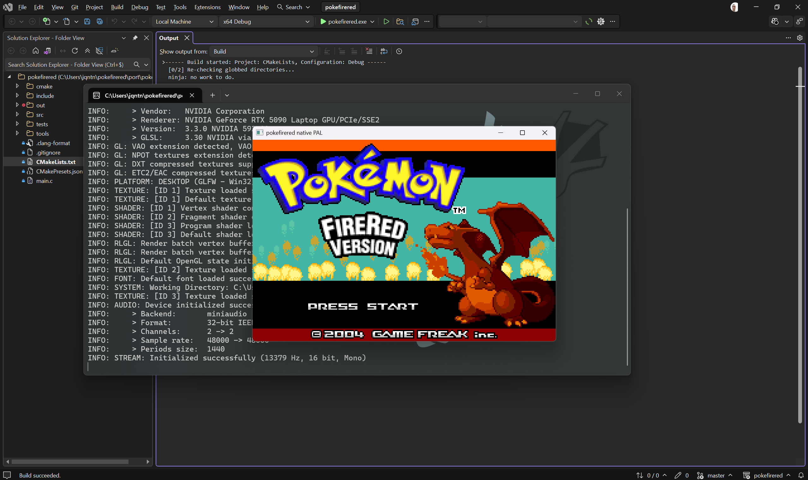

# Pokémon FireRed Desktop Port

Platform abstraction layer for Pokémon FireRed that bridges decompiled game code to a native desktop runtime with hardware-accurate behavior.



## What This Fork Is

This fork builds a native desktop runtime around the decompiled FireRed codebase.

It keeps original game logic, data, and flow intact while replacing GBA-facing platform pieces with host implementations for:

- rendering
- input
- audio
- save storage
- timing
- runtime boot flow
- automated testing

The native layer acts as a PAL between the original game code and a desktop executable, with fidelity to GBA behavior as the bar for correctness.

## Current Scope

The native work lives under `port/pokefirered`.

Current work includes:

- booting through the original startup sequence
- a native runtime for the original game flow
- headless execution for automated checks
- renderer work aimed at hardware-accurate visual behavior
- smoke and integration coverage for PAL/runtime behavior

## Building

The native build uses CMake. Presets are defined in `port/pokefirered/CMakePresets.json`.

### Windows

```powershell
cd port/pokefirered
cmake --preset x64-debug
cmake --build out/build/x64-debug
```

### Linux

```bash
cd port/pokefirered
cmake --preset linux-clang-debug
cmake --build out/build/linux-clang-debug
```

Other presets: `x64-release`, `linux-clang-release`, `linux-gcc-debug`, `linux-gcc-release`.

## Running

From the native build directory:

```text
pokefirered [--mode game|demo] [--headless] [--frames N]
            [--quit-on-title] [--quit-on-main-menu]
            [--auto-press-start-frame N]... [--save-path PATH]
```

Examples:

```powershell
.\pokefirered.exe
.\pokefirered.exe --headless --frames 1600 --quit-on-title
.\pokefirered.exe --mode demo
```

## Controls

Current desktop controls:

### Keyboard

- Arrow keys: `D-Pad`
- X: `A`
- C: `B`
- Enter: `Start`
- Right Shift: `Select`
- S: `L`
- D: `R`

### Gamepad

- D-Pad: `D-Pad`
- South / bottom face button: `A`
- East / right face button: `B`
- Start / Menu: `Start`
- Back / Select: `Select`
- Left trigger 2: `L`
- Right trigger 2: `R`

## Testing

Run the native test suite with:

```powershell
cd port/pokefirered
cmake --build out/build/x64-debug --target test
ctest --test-dir out/build/x64-debug --output-on-failure
```

Formatting: `cmake --build out/build/x64-debug --target format-native`

## Repository Notes

- `port/pokefirered` contains the native PAL/runtime implementation.
- The root codebase still provides the decompiled game code and data that the PAL is adapting.
